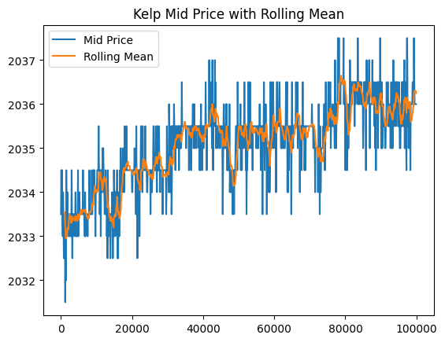
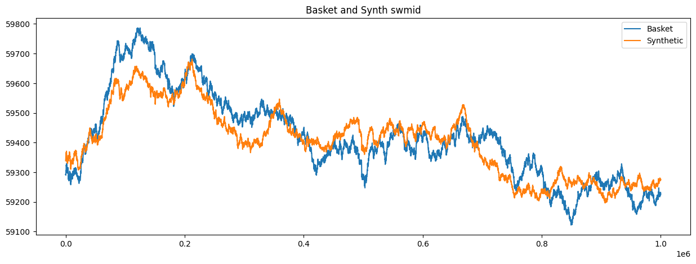
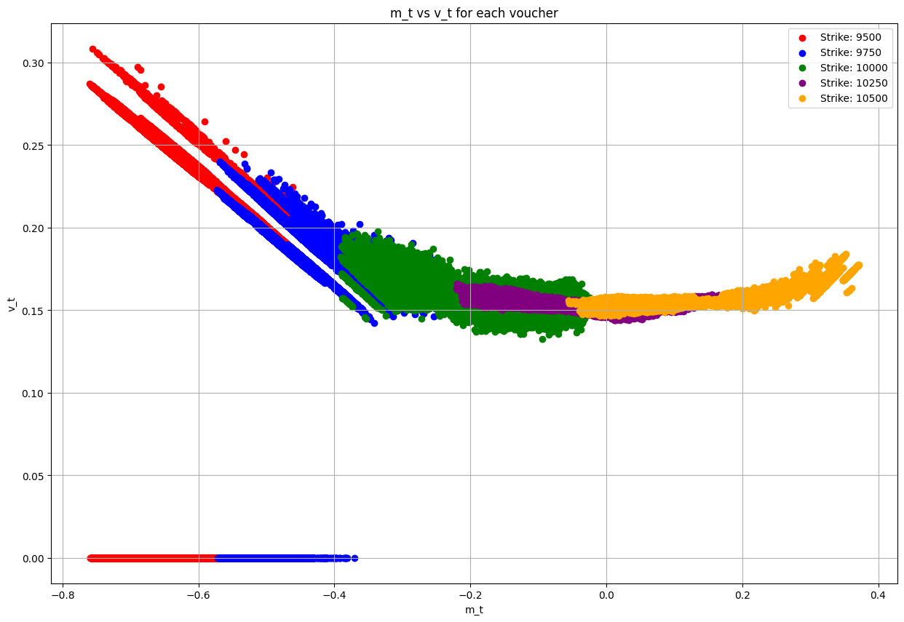
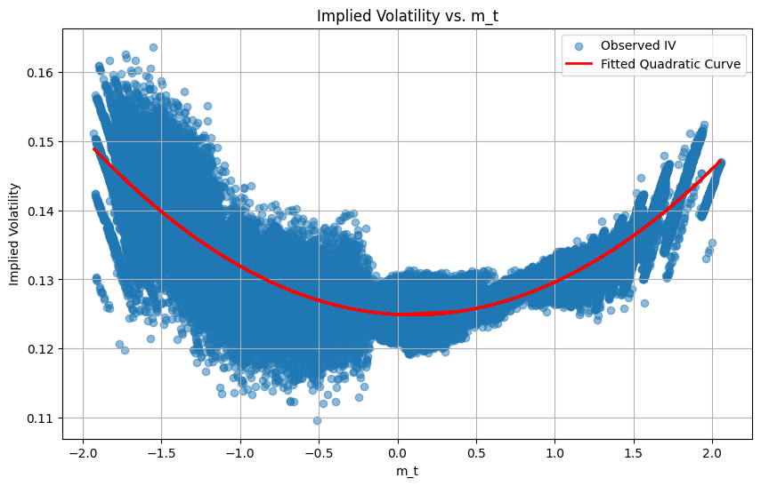
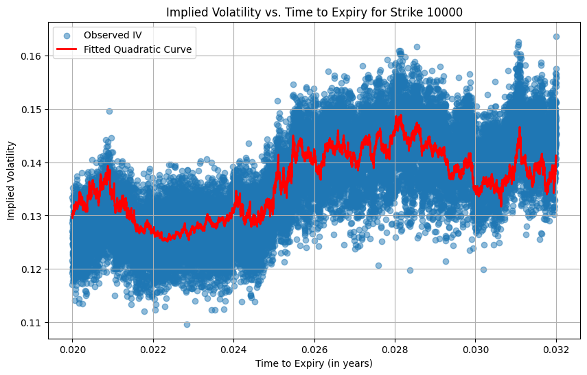

# Prosperity 3 Challenge

## Overview

The Prosperity 3 challenge consisted of 15 days of algorithmic trading, divided into 5 rounds of 72 hours each. Submissions were due at 6 AM for each round.

## Overall Strategy

Given the significant time constraints, our approach prioritized leveraging proven implementations from previous challenges rather than building everything from scratch. We drew inspiration and adapted code from several repositories, which we gratefully acknowledge:

- https://github.com/jmerle/imc-prosperity-3-backtester
- https://github.com/ericcccsliu/imc-prosperity-2/

## Round 1: Building Core Trading Infrastructure

### Market Making and Taking Functions

We developed and refined two fundamental execution strategies that would serve as the foundation for all subsequent rounds: market taking and market making.

#### Market Taking Strategy

Our market taking approach centered on identifying and executing profitable orders from the order book. The core principle was to **take** orders when they deviated from our calculated fair value.

For example, analyzing the RAINFOREST_RESIN price distribution revealed a mean-reverting behavior with prices clustering around 10,000 seashells:


Consider this sample order book:

**Order Book: RAINFOREST_RESIN @ Timestamp 100**

| Side | Price  | Volume |
|------|--------|--------|
| Ask  | 10,005 | 21     |
| Ask  | 10,004 | 1      |
| Bid  | 10,002 | 1      |
| Bid  | 10,000 | 2      |
| Bid  | 9,998  | 4      |

Given the historical data showing high probability of resin trading at 10,000, we could profitably short at the best bid (10,002) and expect to buy back at fair value (10,000). Our strategy maintained market neutrality by closing positions whenever possible.

#### Market Making Strategy

Once attractive orders were cleared from the book, we transitioned to market making. In the above example, after removing the 10,002 bid, we would place a sell order at 10,003 – above our fair value but competitive enough to capture order flow through price-time priority:

**Updated Order Book After Market Taking**

| Side | Price  | Volume |
|------|--------|--------|
| Ask  | 10,005 | 21     |
| Ask  | 10,004 | 1      |
| Bid  | 10,000 | 2      |
| Bid  | 9,998  | 4      |

These two functions – market taking and market making – formed the execution backbone for all our strategies. The general workflow was:
1. Calculate fair value for each product
2. Take orders within acceptable deviation thresholds
3. Make markets at strategic price levels around fair value

### Identifying Market Maker Activity

We observed that certain price levels showed significantly higher volumes, suggesting the presence of informed market makers. In the example above, the 21-unit volume at 10,005 far exceeded other levels. Drawing from previous competition writeups, we identified these as likely market maker orders and adjusted our strategies to avoid adverse selection.

### Product-Specific Strategies

#### Kelp Trading
Kelp exhibited random walk characteristics, leading us to implement a mean reversion strategy based on rolling statistics. We maintained a rolling window of historical prices and traded when prices exceeded certain z-score thresholds. Parameters (window size and z-score thresholds) were optimized through grid search backtesting to maximize PnL.



#### Ink Trading Challenges
Ink proved the most challenging product due to high volatility and sudden price movements. Despite positive backtesting results using a similar approach to Kelp, live trading performance in Round 1 was disappointing. We subsequently discovered that Ink prices contained embedded signals in the trading history that other teams successfully exploited – a feature we incorporated once we received identified trader data in Round 5.

## Round 2: ETF Arbitrage and Basket Trading

### Overview

Round 2 introduced ETF-style arbitrage opportunities through basket trading. The tradeable assets included individual products (croissants, jams, djembes) and two composite products (picnic baskets). Our strategy focused on exploiting price discrepancies between the baskets and their underlying components.

### Basket Compositions

The challenge provided the following basket definitions:

**PICNIC_BASKET1** contains:
- 6 × CROISSANTS
- 3 × JAMS
- 1 × DJEMBE

**PICNIC_BASKET2** contains:
- 4 × CROISSANTS
- 2 × JAMS

### Core Strategy: Synthetic Basket Arbitrage

We identified the opportunity to construct synthetic baskets using the individual components and trade the spread between actual and synthetic basket prices. The strategy involved:

1. **Calculating synthetic basket prices**: Sum of (component price × quantity) for each basket
2. **Identifying mispricings**: When actual basket price deviated from synthetic price
3. **Executing arbitrage**: Buying underpriced baskets while selling components (or vice versa)



### Exploring Complex Synthetic Instruments

We invested considerable effort exploring market-neutral combinations beyond simple basket arbitrage. Through algebraic manipulation of the basket compositions:

```
B1 = 6C + 3J + 1D
B2 = 4C + 2J

From these, we derived relationships such as:
B1 = B2 + 2C + 1J + 1D
2B1 = 3B2 + 2D
```

This analysis revealed hundreds of potential synthetic instruments that could maintain asset neutrality. We developed functionality to:
- Generate all possible neutral combinations
- Check position limit compliance for each synthetic instrument
- Price these complex synthetic positions

However, despite the theoretical elegance of these combinations, we were unable to translate them into significantly higher trading profits. The additional complexity didn't justify the marginal gains, leading us to treat this exploration as a learning experience rather than a core strategy component.

### Final Implementation

After evaluating various approaches, we adopted a streamlined strategy focusing on PICNIC_BASKET1:

1. **Mean Reversion Trading**: Historical analysis showed the basket-synthetic spread exhibited mean-reverting behavior
2. **Entry Signals**: 
   - Short the basket when spread exceeded upper threshold
   - Long the basket when spread fell below lower threshold
3. **Position Management**: Return to neutral positions when spread normalized

### Strategic Decision: No Hedging

While we could have hedged our basket positions with the underlying instruments, we made a deliberate choice not to:

- **Rationale**: Expected profits from unhedged positions outweighed the variance reduction from hedging
- **Assumption**: Strong correlation between basket and synthetic prices would limit downside risk
- **Lead-Lag Relationship**: We observed that baskets tended to follow synthetic price movements with a slight delay, providing additional trading signals

This calculated risk allowed us to maintain simpler execution while capturing the full spread movement, rather than just the convergence component that hedging would have provided.

## Round 3: Options Trading and Volatility Smile

### Overview

Round 3 introduced options trading with a focus on implied volatility analysis. The organizers provided a crucial hint about examining the relationship between option moneyness and implied volatility, immediately pointing us toward volatility smile trading strategies.

### Volatility Smile Analysis

We began by plotting the implied volatility surface across different strike prices and maturities, revealing the characteristic volatility smile pattern:





Our analysis revealed systematic mispricings in the options market, particularly for near-the-money options where we had the most confidence in our volatility estimates.

### Trading Strategy: Implied Volatility Arbitrage

We developed a systematic approach to identify and trade volatility mispricings:

1. **Calculate Expected Implied Volatility**: Using our fitted smile curve model
2. **Compare with Market Implied Volatility**: Extract actual IVs from market prices
3. **Generate Trading Signals**: Trade when the difference exceeded threshold values
   - Long options when market IV < expected IV (underpriced volatility)
   - Short options when market IV > expected IV (overpriced volatility)



### Implementation Challenges

#### Strike Price Limitations
Our strategy performed well for at-the-money and near-the-money options but faced significant challenges elsewhere:

- **Deep In-The-Money Options**: Extreme moneyness values produced unreliable volatility estimates
- **Low Strike Options**: Poor model fit and inconsistent results led us to exclude these from our trading universe
- **Solution**: We filtered our trading to focus on strikes within a reasonable moneyness range where our model showed statistical significance

### Results and Learnings

This round coincided with team members' travel schedules, significantly limiting our development time. While our rushed implementation prevented us from fully exploiting the volatility smile opportunities, the strategy showed promise for the strikes we did trade. Key takeaways included:

- The importance of focusing on liquid, near-the-money options where pricing models are most reliable
- The value of filtering outliers rather than attempting to trade every available strike
- The trade-off between model sophistication and implementation reliability under time constraints

Given more time, we would have extended our analysis to properly handle the full strike range and potentially incorporated term structure effects into our volatility model.

## Round 4

Cross-market exchange arbitrage with macaron conversions
[To be completed]


## Round 5

[To be completed]